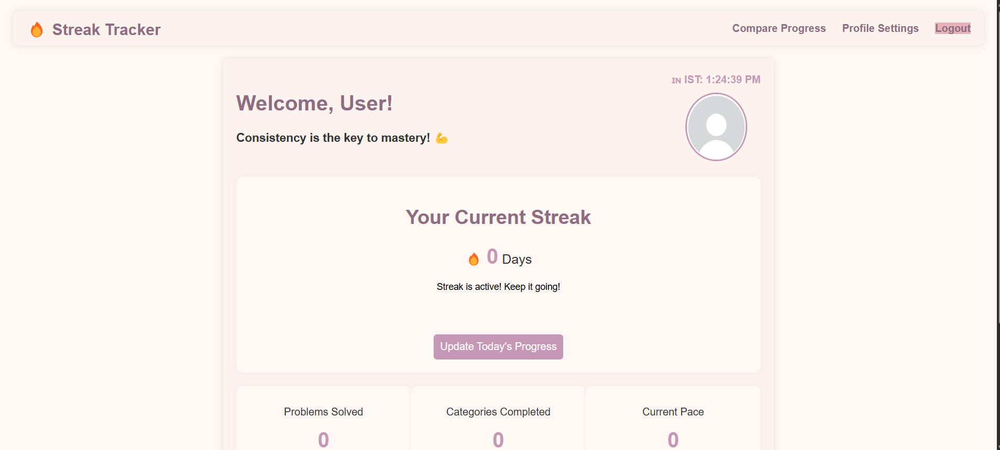

# Streak Tracker

A web application for tracking daily coding streaks, problem-solving progress, and maintaining consistency in your learning journey. Perfect for coding interview preparation and building consistent learning habits.



## Features

### Core Functionality
- **Streak Tracking**: Record daily activity to maintain your coding streak
- **Problem Organization**: Track your progress through common coding interview problems
- **Achievement System**: Unlock badges and achievements as your streak grows
- **Progress Visualization**: View statistics on problems solved, categories completed, and your pace
- **User Comparison**: Compare your progress with others for friendly competition
- **Profile Management**: Customize your profile and upload a profile picture

### Technical Features
- Full MERN stack application (MongoDB, Express, React, Node.js)
- Responsive design for desktop and mobile
- JWT-based authentication
- Timezone support for accurate streak tracking worldwide
- Admin dashboard for user management

## Pages & Navigation

- **Landing Page**: Information about the application with registration and login options
- **Dashboard**: View your current streak, achievements, and solved problems
- **Comparison Page**: See how your progress compares with others
- **Profile Settings**: Update your profile settings and upload a profile picture
- **Admin Panel**: Manage users and view system statistics (admin only)

## Setup Instructions

### Prerequisites
- Node.js (v16 or higher)
- MongoDB (v4.4 or higher)
- npm or yarn

### Installation

1. **Clone the repository**
   ```bash
   git clone https://github.com/yourusername/streak-tracker.git
   cd streak-tracker
   ```

2. **Set up the backend**
   ```bash
   cd backend
   npm install
   ```

3. **Create necessary environment variables**
   Create a `.env` file in the backend directory with:
   ```
   PORT=5001
   MONGO_URI=mongodb://localhost:27017/streak-tracker
   JWT_SECRET=your_jwt_secret_key
   ```

4. **Initialize the database**
   ```bash
   npm run seed
   ```

5. **Set up file storage**
   ```bash
   mkdir -p uploads/avatars
   ```

6. **Start the backend server**
   ```bash
   npm run dev
   ```

7. **Open a new terminal and navigate to frontend**
   The frontend is plain HTML/CSS/JS and doesn't require installation. You can access it directly through the backend server, which serves the static files.

8. **Access the application**
   Open your browser and navigate to:
   ```
   http://localhost:5001
   ```

## Usage Guide

### Registration and Login
1. Create an account with your username, password, and timezone
2. Login with your credentials
3. Admin account (username: `admin`, password: `admin`) is created automatically on first run

### Tracking Your Streak
1. Navigate to your dashboard
2. Click "Update Today's Progress" to register your daily activity
3. Your streak will increase by 1 if you maintain daily activity
4. If you miss a day, your streak will reset to 0

### Problem Tracking
1. On your dashboard, find problems organized by categories
2. Mark problems as complete by checking the boxes
3. View your progress statistics at the top of the dashboard

### Comparing Progress
1. Navigate to the Comparison page
2. View how your streak and problem-solving progress compare with others
3. See real-time clocks for each user based on their timezone

### Profile Management
1. Navigate to Profile Settings
2. Update your timezone
3. Upload or change your profile picture
4. Change your password if needed

### Admin Features
1. Login with admin credentials
2. Navigate to the Admin Panel
3. View system statistics
4. Manage users (reset streaks, delete users, etc.)

## Technical Architecture

### Frontend
- HTML5, CSS3, JavaScript
- No framework, built with vanilla JS for simplicity
- Responsive design using Flexbox and CSS Grid
- Client-side rendering with data fetched from the API

### Backend
- Node.js with Express
- RESTful API architecture
- JWT authentication
- MongoDB for data storage
- Multer for file uploads

### Database Models
- User: Stores user account information
- Streak: Tracks user streak data
- Problem: Defines coding problems to solve
- UserProblem: Tracks user's progress on problems
- Achievement: Defines available achievements
- UserAchievement: Tracks earned achievements

## API Endpoints

### Authentication
- `POST /api/auth/register`: Register a new user
- `POST /api/auth/login`: Login and get authentication token

### Streaks
- `GET /api/streaks`: Get user's streak information
- `POST /api/streaks/update`: Update daily streak
- `DELETE /api/streaks/reset`: Reset a user's streak

### Problems
- `GET /api/problems`: Get all problems with completion status
- `POST /api/problems/:problemId/toggle`: Toggle problem completion

### User Profile
- `PUT /api/users/profile`: Update user profile and avatar
- `PUT /api/users/password`: Change user password

### Comparison
- `GET /api/comparison`: Get comparison data for all users

### Admin
- `GET /api/admin/users`: Get all users (paginated)
- `POST /api/admin/users`: Add a new user
- `DELETE /api/admin/users/:userId`: Delete a user
- `POST /api/admin/users/:userId/reset-streak`: Reset a user's streak
- `GET /api/admin/stats`: Get system statistics

## Contributing

1. Fork the repository
2. Create your feature branch (`git checkout -b feature/amazing-feature`)
3. Commit your changes (`git commit -m 'Add some amazing feature'`)
4. Push to the branch (`git push origin feature/amazing-feature`)
5. Open a Pull Request

## License

This project is licensed under the MIT License - see the LICENSE file for details.

## Acknowledgments

- Inspired by the NeetCode 150 problem set
